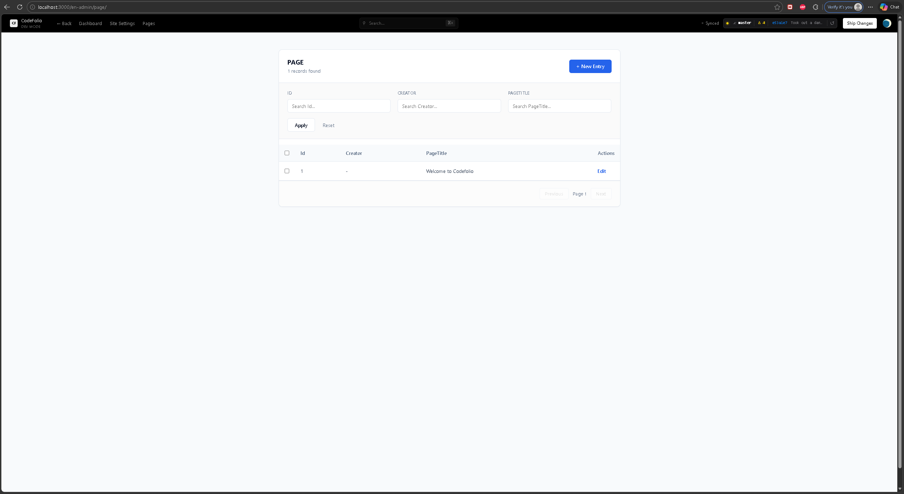
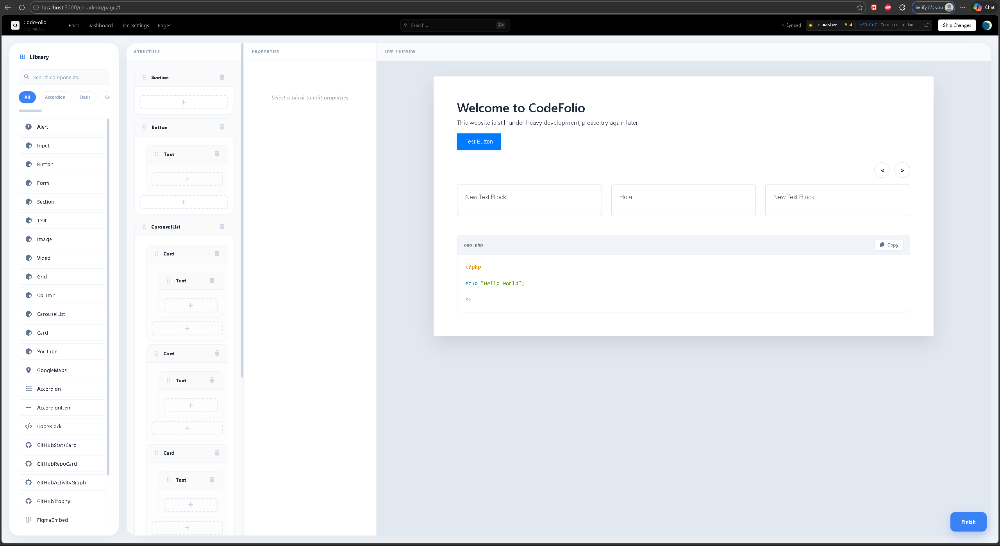
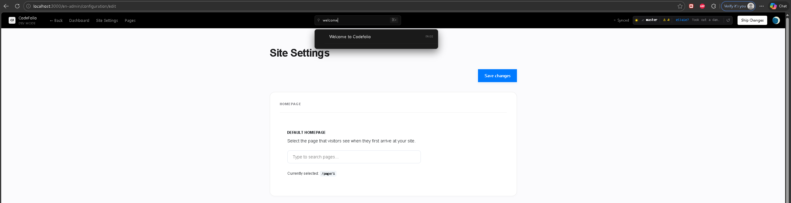
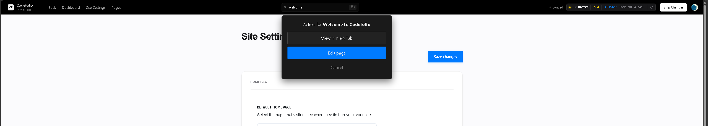

# Getting Started with Codefolio

Codefolio is a git-first, local-first framework for building portfolios, documentation sites, and static web apps. You author everything offline, version it with git, and deploy to GitHub Pages. No cloud services, no CMS, no attack surface.

---

## Prerequisites

- [Node.js](https://nodejs.org) (v18 or later recommended)
- [Git](https://git-scm.com)
- A [GitHub account](https://github.com) if you want to deploy

---

## 1. Clone the repo

```bash
git clone https://github.com/hudson1998x/codefolio.git
cd codefolio
```

---

## 2. Set up your own git repository

Since you cloned from the Codefolio template, you'll need to detach it from the original repo and point it at your own. The easiest way is to remove the existing `.git` directory and reinitialise:

```bash
# Remove the existing git history and remote
rm -rf .git

# Initialise a fresh repo
git init

# Point it at your own GitHub repo
git remote add origin https://github.com/YOUR_USERNAME/YOUR_REPO.git
```

After this, your project is fully yours with no link back to the template.

---

## 3. Install dependencies

```bash
npm install
```

---

## 4. Start the local dev server

```bash
npm start
```

Your site will be running locally at `http://localhost:3000`. The admin panel is at `http://localhost:3000/en-admin/`.

---

## 5. Change the theme

> ⚙️ A theme picker in the admin panel is coming soon. For now it's a quick manual edit in the site config.

Themes in Codefolio are registered layout components. Each theme wraps your page content with its own header, footer, and styles. The active theme is resolved at runtime in this order:

1. The `theme` key in your site config, if set
2. `@admin` applied automatically to all `/en-admin` routes, always
3. `default` the fallback for everything else

To create your own theme, define a layout component and register it:

```tsx
import { registerTheme } from "app/web/thirdparty/theme";

const MyTheme = ({ children }) => (
  <div className="theme-mine">
    <header>...</header>
    <main>{children}</main>
    <footer>...</footer>
  </div>
);

registerTheme('mine', MyTheme);
```

Then reference it by name in your site config (`theme: "mine"`). The `@admin` theme is reserved and not modifiable.

---

## 6. Add pages & content

Head to `http://localhost:3000/en-admin/` and click **Pages**. You'll be greeted with an auto table a default list view generated automatically for any entity collection that doesn't need a custom UI.



From there, click **New Entry** to create a page (or **Edit** on an existing one). Fill in the page title and description, then click **Visual Editor** below the description field. This opens the drag and drop editor where you can pull in components, arrange them, and build out your page visually.



When you're done editing, click **Finish** to close the editor, then **Save** on the page form to persist your changes. Both steps are required Finish commits the canvas, Save writes it to disk.

Everything is written back to `/content` as plain JSON, so it's always in your hands and under version control.

---

## 7. Publish with git

The entire repository is what gets served. Point any static host at the repo root and it just works. GitHub Pages is the primary target and handles this automatically on push, but the same repo works on Netlify, Vercel, Cloudflare Pages, an S3 bucket, a VPS, or any host that serves static files.

When you're happy with your changes:

```bash
git add .
git commit -m "your message"
git push
```

`index.html` is the app entry point and `404.html` is an exact clone of it, acting as a catch-all so the app's own router handles every URL. If a page genuinely doesn't exist, the app renders its built-in 404 page.

---

## Search

The admin panel has a global search bar at the top (or press `Ctrl+K`). Type to find any page by its searchable fields and you'll get results instantly.



Clicking a result gives you two options: **View in New Tab** to preview the live page, or **Edit Page** to jump straight to the editor.



---

## Project structure (quick reference)

```
codefolio/
├── app/
│   └── web/
│       ├── themes/
│       │   ├── index.ts        # Theme loader/registry
│       │   ├── default/        # Default frontend theme
│       │   └── @admin/         # Admin UI theme (not modifiable)
│       ├── thirdparty/         # Codefolio's core code
│       └── user/
│           └── plugins/        # Your plugins, components, and extensions
├── build/                      # Compiled JS, CSS, config.json, index.html and 404.html
└── content/                    # Your site content as JSON (pages, nav, settings, etc.)
```

All content in Codefolio is plain JSON. Your data is fully portable and can feed other tools, be processed by scripts, or consumed directly by AI models without any proprietary export step. You own it completely.

### How content is stored

Each entity type (like `Page`) gets its own collection directory under `/content`. When you create or edit a page, it is written as an individual JSON file (`1.json`, `2.json`, etc.) and a corresponding entry is appended to an `index.ndjson` file newline-delimited JSON, one record per line.

```
content/
└── page/
    ├── .auto_increment   # next available ID
    ├── index.ndjson      # one record per line, used for search
    ├── 1.json
    └── 2.json
```

The index is streamed line-by-line rather than loaded all at once, so search stays memory-efficient regardless of collection size. Fields marked `searchable: true` on the entity definition are what power that search.

---

## Next steps

- Add your content to `/content`
- Customise your theme
- Push to GitHub and enable Pages under your repo's **Settings > Pages**

Questions or issues? Open one on [GitHub](https://github.com/hudson1998x/codefolio/issues).

---

## What's coming

Codefolio is moving fast. Here's what's on the way:

**Theme selection** - a simple dropdown in the site config will let you switch themes without touching any files. Pick one, save, done.

**Drag and drop editor** - already shipped. Build and rearrange pages visually without touching JSON directly. Everything still saves to `/content` as plain JSON, so you keep full ownership and nothing is locked away in a proprietary format.

**Updates and prefabs** - scaffolding out common page structures, sections, and layouts is about to get a whole lot faster. Drop in a prefab, customise what you need, and ship.

Scaffolding websites while owning your data has never been more transparent.